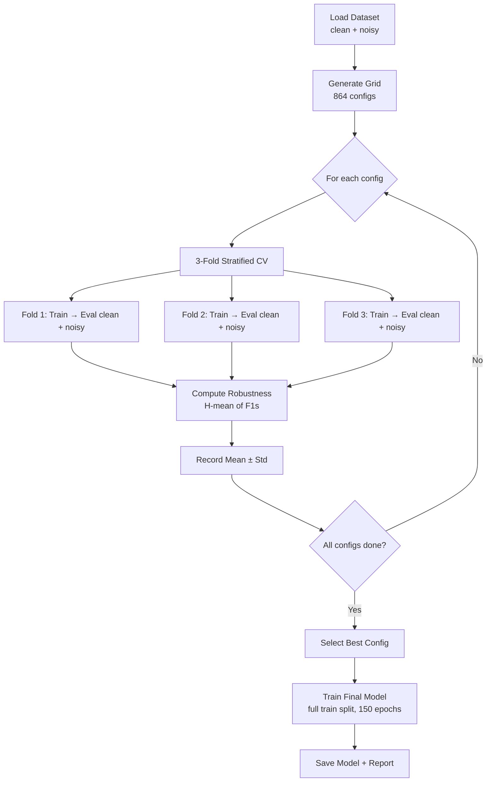

# Hyperparameter Optimisation — Specification

## Overview

This document describes the hyperparameter optimisation (HPO) pipeline for the
1D-CNN touch classifier. The objective is to identify the configuration that
maximises robustness—defined as strong performance on both clean and noisy EIT
measurements—in alignment with the dissertation's core research question on
simulation-to-reality transfer.

## Objective Function

The optimisation target is **robustness**, defined as the harmonic mean of macro-F1 on clean test data and macro-F1 on noisy test data:

$$\text{Robustness} = \frac{2 \cdot F1_{\text{clean}} \cdot F1_{\text{noisy}}}{F1_{\text{clean}} + F1_{\text{noisy}}}$$

The harmonic mean penalises configurations that sacrifice performance on one condition for the other. A model scoring 0.99 on clean but 0.50 on noisy would receive a robustness of 0.67, whereas a balanced 0.90/0.88 model achieves 0.89.

### Justification for Harmonic Mean

The arithmetic mean (0.745 for the 0.99/0.50 case) is less punitive of extreme
imbalances. For a sim-to-real pipeline where both evaluation conditions must yield
acceptable performance, the harmonic mean enforces this constraint by construction.

## Search Strategy

**Grid search** is employed rather than random or Bayesian approaches for the
following reasons:
1. The search space is tractable (864 configurations × 3 folds = 2,592 evaluations)
2. Exhaustive enumeration ensures reproducibility and complete landscape coverage
3. Results are straightforward to analyse and report without stochastic confounds
4. No surrogate model assumptions are required

## Search Space

| Hyperparameter | Values | Rationale |
|---|---|---|
| **Architecture (channels)** | `[32,64,128]`, `[64,128,256]`, `[32,64,128,256]`, `[64,128,256,512]` | Tests width and depth variations |
| **FC dimension** | 128, 256 | Classifier head capacity |
| **Dropout** | 0.2, 0.3, 0.5 | Regularisation strength |
| **Learning rate** | 1e-3, 5e-4, 1e-4 | Training speed vs stability |
| **Batch size** | 32, 64, 128 | Gradient noise vs throughput |
| **Weight decay** | 1e-4, 1e-3 | L2 regularisation |
| **Noise augmentation** | False, True | Online domain randomisation |

**Total configurations**: 4 × 2 × 3 × 3 × 3 × 2 × 2 = **864**

## Evaluation Protocol

Each configuration is evaluated with **3-fold stratified cross-validation**:

1. Data is split into 3 stratified folds
2. For each fold:
   - A RobustScaler is fit on the training fold only (no leakage)
   - The model is trained with early stopping (patience=20)
   - The model is evaluated on both clean and noisy validation data
   - Robustness score is computed
3. Mean and standard deviation of robustness across folds is recorded

### Justification for 3-Fold Cross-Validation

With 864 configurations, 3-fold CV yields 2,592 training runs. At approximately
30–60 seconds per run on GPU, the total compute requirement is 24–48 hours.
Three folds provides sufficiently reliable estimates while remaining
computationally tractable; the trade-off between estimation variance and compute
cost favours tractability given the exhaustive grid coverage.

## Pipeline Architecture



## Noise Augmentation Configuration

When `noise_augmentation=True`, the training loop applies the project's
4-component physically-motivated noise model on-the-fly:

1. **Gaussian measurement noise** (SNR=40dB)
2. **Contact impedance variation** (σ=10%)
3. **Electrode positioning bias** (max=0.02)
4. **Quantisation noise** (16-bit ADC)

Severity is sampled uniformly from [0.5, 2.0] per batch (multi-severity domain
randomisation), requiring the model to generalise across a range of degradation
levels rather than over-specialising to a single noise intensity.

## Computational Infrastructure

The pipeline automatically detects and utilises CUDA if available:
- All model training and inference executes on GPU
- Pin memory is enabled for efficient CPU→GPU data transfer
- `torch.backends.cudnn.deterministic = True` ensures reproducibility across runs

## Checkpoint and Resume Support

The grid search saves checkpoints incrementally:
- Completed trial UIDs are stored in `grid_search_checkpoint.json`
- Results are saved to `grid_search_results.csv` after each trial
- Use `--resume` to skip completed trials if interrupted

## Output Artefacts

All outputs are written to `results/hyperparameter_optimisation/`:

| File | Description |
|---|---|
| `grid_search_results.csv` | Full results table (sorted by robustness) |
| `grid_search_checkpoint.json` | Resume checkpoint (completed trial UIDs) |
| `cnn1d_optimised_best.pt` | Best model checkpoint (state dict + config + metrics) |
| `final_model_history.json` | Training curves for the final model |
| `optimisation_report.json` | Summary report (best config, metrics, model info) |

## Usage

```bash
# Full pipeline (grid search + final model training)
eit experiments hyperopt

# Or run directly with custom settings:
uv run python -m eit_sim2real.experiments.hyperopt \
  --n-folds 5 \
  --epochs 150 \
  --output-dir results/hpo_extended

# Resume interrupted run
uv run python -m eit_sim2real.experiments.hyperopt --resume

# Skip search, retrain final model from existing results
uv run python -m eit_sim2real.experiments.hyperopt --final-only

# Use raw dataset instead of cleaned
uv run python -m eit_sim2real.experiments.hyperopt --data-path data/eit_dataset.mat
```

## Loading the Optimised Model

```python
import torch
from eit_sim2real.models.cnn1d import EITConv1D

checkpoint = torch.load("results/hyperparameter_optimisation/cnn1d_optimised_best.pt",
                        weights_only=True)
config = checkpoint["config"]

model = EITConv1D(
    n_features=checkpoint["n_features"],
    n_classes=checkpoint["n_classes"],
    channels=config["channels"],
    fc_dim=config["fc_dim"],
    dropout=config["dropout"],
)
model.load_state_dict(checkpoint["model_state_dict"])
model.eval()

print(f"Robustness: {checkpoint['metrics']['robustness']:.4f}")
print(f"Clean F1: {checkpoint['metrics']['clean_f1']:.4f}")
print(f"Noisy F1: {checkpoint['metrics']['noisy_f1']:.4f}")
```

## Alignment with Research Objectives

The HPO pipeline directly addresses the dissertation's research questions:

| Research Objective | HPO Alignment |
|---|---|
| **RQ1**: How does noise-aware training affect performance? | Grid includes `noise_augmentation=True/False` for direct comparison |
| **RQ3**: Can models generalise to unseen severity? | Multi-severity training (0.5–2.0×) tests out-of-distribution generalisation |
| **Hypothesis 1**: Noise-augmented outperforms clean-trained | Robustness metric quantifies the gap |
| **Hypothesis 3**: CNN outperforms baselines under corruption | Optimised CNN provides the strongest possible comparator |

The robustness objective ensures the selected configuration represents the best
candidate for the sim-to-real transfer evaluation presented in the results chapter.
